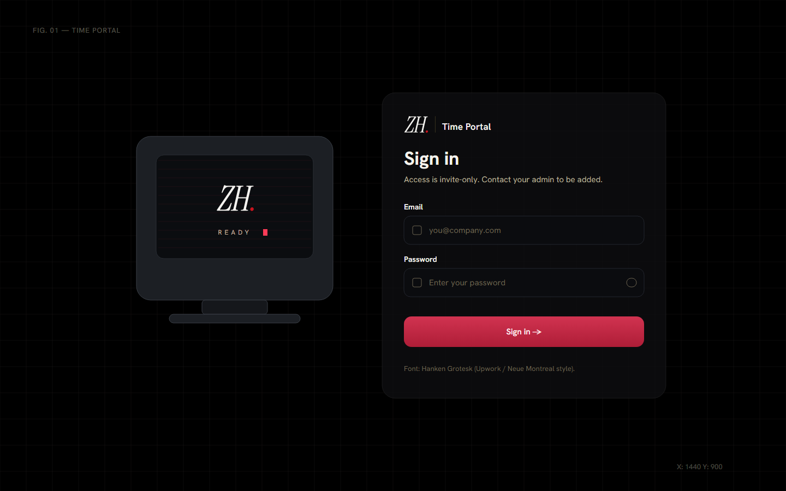
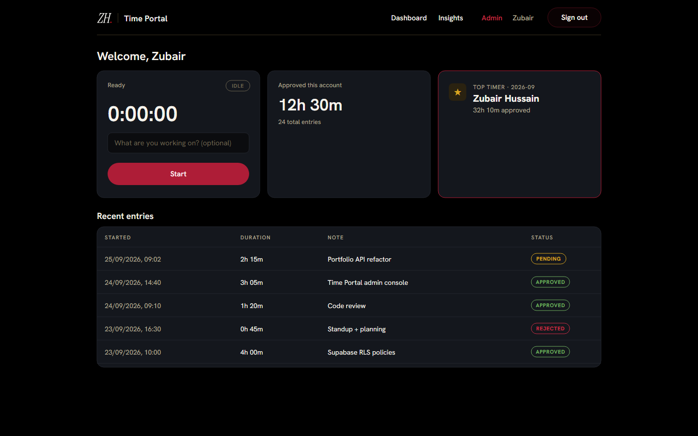
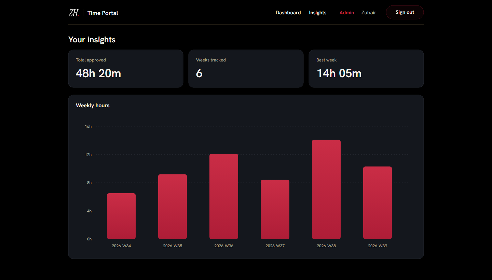
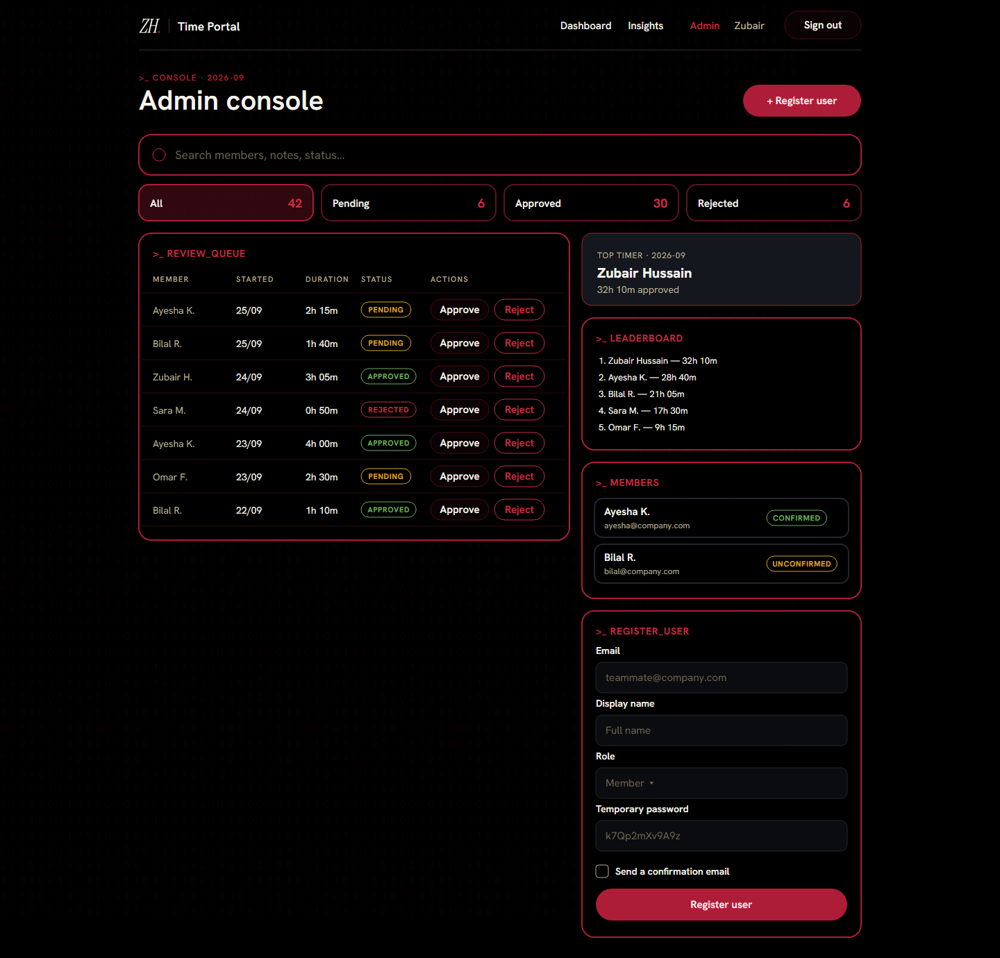
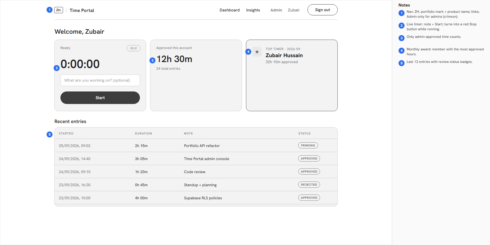

<!-- =====================================================================
     TIME PORTAL — README
     ===================================================================== -->

<div align="center">

<picture>
  <source media="(prefers-color-scheme: dark)" srcset="logo/svg/time-portal-lockup-dark.svg" />
  
</picture>

# ⏱️ Time Portal

**A secure, invite-only time-tracking portal with JWT auth, weekly insights, and a monthly award system — themed to match the [ZH portfolio](https://zubair-hussain-portfolio.detroonshah.workers.dev/).**

Built with **Next.js 15 (static export → `out/`)** · **TypeScript (strict)** · **Supabase** · **Cloudflare Workers** · **Jest + Testing Library**

[](https://nextjs.org/)
[](https://www.typescriptlang.org/)
[](https://supabase.com/)
[](#-deployment)
[](#-testing)
[](#-coverage)
[](#-audits)
[](#-audits)
[](#-license)

</div>

---

## 📑 Table of contents

1. [What is Time Portal?](#-what-is-time-portal)
2. [Feature overview](#-feature-overview)
3. [Wireframes & Figma design](#-wireframes--figma-design)
4. [Design language & logo](#-design-language)
5. [Architecture](#-architecture)
6. [Security model](#-security-model)
7. [Tech stack](#-tech-stack)
8. [Project structure](#-project-structure)
9. [Prerequisites](#-prerequisites)
10. [Quick start](#-quick-start)
11. [Environment variables](#-environment-variables)
12. [Supabase setup](#-supabase-setup)
13. [Database schema & RLS](#-database-schema--rls)
14. [Admin: adding users (no public sign-up)](#-admin-adding-users-no-public-sign-up)
15. [Email verification](#-email-verification)
16. [Running the app](#-running-the-app)
17. [Static export (`out/`)](#-static-export-out)
18. [Deployment](#-deployment)
18a. [CI/CD & GitHub workflows](#-cicd--github-workflows)
18b. [Audits](#-audits)
19. [Testing](#-testing)
20. [Coverage](#-coverage)
21. [Jest snapshots](#-jest-snapshots)
22. [Scripts reference](#-scripts-reference)
23. [Domain model](#-domain-model)
24. [Core modules (API reference)](#-core-modules-api-reference)
25. [Weekly insights explained](#-weekly-insights-explained)
26. [Monthly award logic](#-monthly-award-logic)
27. [JWT handling](#-jwt-handling)
28. [Theming & tokens](#-theming--tokens)
29. [Accessibility](#-accessibility)
30. [Performance](#-performance)
31. [Troubleshooting](#-troubleshooting)
32. [FAQ](#-faq)
33. [Roadmap](#-roadmap)
34. [Contributing](#-contributing)
35. [License](#-license)

---

## 🌍 What is Time Portal?

Time Portal is a small, focused web application for **tracking working time inside a
closed team**. It is deliberately *invite-only*: there is **no public sign-up
anywhere in the product**. Members are provisioned by an administrator, sign in with
their email + password, start/stop a live timer for each work session, and watch their
**weekly insights** build up over time.

Administrators get an extra surface: they **review** every submitted entry (approve or
reject), watch a **monthly leaderboard**, and the person with the most *approved* hours
each month is crowned the **Top Timer** — a light, motivating award.

The whole thing is built as a **static Next.js export** (`output: 'export'`), so the
compiled site is a folder of plain HTML/CSS/JS in `out/` that can be dropped on any
static host — Cloudflare Workers/Pages, Netlify, S3, GitHub Pages — with **no Node
server required at runtime**. All dynamic behaviour (auth, data, real-time) is handled
by **Supabase** directly from the browser, guarded by **Row Level Security**.

> **Why static + Supabase?** It keeps hosting cost near-zero, matches the deployment
> style of the ZH portfolio (Cloudflare Workers), and pushes all trust boundaries into
> Postgres RLS where they can be reasoned about precisely.

---

## ✨ Feature overview

| Area | Capability |
| --- | --- |
| **Auth** | Email + password sign-in via Supabase JWT. Session persisted & auto-refreshed. |
| **No sign-up** | The public app exposes **sign-in only**. Accounts are created by admins. |
| **One-click registration** | Admins add members/admins from the **Register user** panel; the account is created in Supabase instantly. |
| **Email verification** | Every registered email is checked for syntax, disposable domains and mail-capable domain, with typo suggestions. |
| **Live timer** | Start/stop stopwatch with an optional note; ticks every second. |
| **Entries** | Every session is stored as a `time_entry` with a review status. |
| **Weekly insights** | Per-ISO-week totals, active-day averages, and a bar chart of hours. |
| **Monthly award** | Automatic "Top Timer" — the member with the most *approved* seconds. |
| **Admin review** | Admins approve/reject entries; only approved time counts toward awards. |
| **Leaderboard** | Admin sees the month's ranking of members by approved time. |
| **RBAC** | `admin` vs `member` roles, derived from the verified JWT and enforced by RLS. |
| **Theming** | Matched to the ZH portfolio: crimson on black; Upwork-style single sans family (Hanken Grotesk ≈ Neue Montreal). |
| **Login experience** | Retro CRT with an in-screen GSAP loading bar, blueprint line-art backdrop, glass sign-in card. Respects `prefers-reduced-motion`. |
| **Branding** | The portfolio's own **ZH.** mark and red Z favicon as outlined vectors, with a full logo pack in [`logo/`](logo/). |
| **Type safety** | `strict` TypeScript + `noUncheckedIndexedAccess` for defensive code. |
| **Tested** | 216 unit/component tests, ~95% statement coverage, snapshot tests. |
| **Static** | Ships as an `out/` folder, deployed to Cloudflare Workers with security headers. |
| **CI/CD** | GitHub Actions: lint/typecheck/test/build → deploy; security (npm audit, CodeQL, gitleaks, dependency review); Lighthouse + SEO budgets. |
| **Audited** | Cloudflare security-audit skill run, Lighthouse 99–100, 27/27 SEO checks. See [`AUDIT.md`](AUDIT.md). |

---

## 📐 Wireframes & Figma design

Two root folders describe every screen, generated from the real components so they match the app:

| Folder | What's inside |
| --- | --- |
| [`wireframes/`](wireframes/) | Low-fidelity grey layouts with numbered annotations: sign-in, dashboard, insights, admin console (desktop 1440) plus sign-in and dashboard (mobile 390). SVG + PNG. |
| [`figma-design/`](figma-design/) | High-fidelity, **Figma-importable** SVG frames of the same screens, a design-system sheet (logo, colours, type scale, components) and [`design-tokens.json`](figma-design/design-tokens.json) for Tokens Studio / Figma Variables. Import steps are in [its README](figma-design/README.md). |

### Sign in



### Member dashboard



### Weekly insights



### Admin console



### Wireframe example



---

## 🎨 Design language

The theme is not invented — it is **extracted from the live portfolio's computed
styles** so the two products feel like one brand.

| Token | Value | Role |
| --- | --- | --- |
| Background | `#000000` | Page canvas (pure black) |
| Card surface | `#14171d` | Elevated panels (`hsl(220 22% 10%)`) |
| Secondary surface | `#1b1f27` | Inputs / secondary buttons |
| Text | `#f6f3ec` | Warm off-white (`hsl(42 32% 94%)`) |
| Dim text | `#b6ad98` | Muted labels (`hsl(42 16% 64%)`) |
| **Primary / accent** | **`#ae1d37`** | **Crimson** — buttons, logo, active nav, focus rings |
| Accent (hover) | `#ca2d46` | Brighter crimson for gradients and hover |
| Success | `#6fae5f` | Approved state |
| Warning | `#d9a520` | Pending state (gold is used only here) |

**Typography — one family, like Upwork:**

Upwork sets every piece of text (headings, UI, numbers) in **Neue Montreal**, weight 550 for
headings and slightly positive letter-spacing. Neue Montreal is a paid typeface, so the app uses
**Hanken Grotesk**, the closest free (OFL) match, side-by-side checked against Upwork's live font.
It is self-hosted by `next/font` (no runtime request to Google).

- Font stack: `'Neue Montreal', Hanken Grotesk, 'Helvetica Neue', Helvetica, Arial, sans-serif`. A licensed, installed Neue Montreal wins automatically.
- Headings: weight **550**, line-height 1.1. Body: 400 with +0.02em tracking.
- Numbers (timer, stats, tables) use the same family with **tabular numerals**. There is no separate mono or serif face.

**Logo:** the portfolio's own mark, **ZH.**: "ZH" in Instrument Serif Italic `#f5f4f0` with a crimson `#c8141e` dot.
The favicon/app icon is the portfolio's red `#ff0000` tile with a white "Z". Both are outlined vector paths, so
they render identically everywhere.

| Where | Files |
| --- | --- |
| Root vectors | [`logo.svg`](logo.svg) (ZH. mark) · [`logo-mark.svg`](logo-mark.svg) (Z tile) |
| Full pack | [`logo/`](logo/): SVG + PDF (vector) + PNG for dark/light/black backgrounds, the "ZH. \| Time Portal" lockup, and the app icon |
| In the app | [`ZHLogo.tsx`](src/components/ZHLogo.tsx) (same paths) · `public/favicon.svg` · `public/logo.svg` |

All tokens live as CSS custom properties in [`src/app/globals.css`](src/app/globals.css),
so retheming is a one-file change. The same tokens are exported for Figma in
[`figma-design/design-tokens.json`](figma-design/design-tokens.json).

---

## 🏗️ Architecture

```
┌─────────────────────────────────────────────────────────────────┐
│  Browser (static site served from  out/ )                        │
│                                                                   │
│   Next.js App Router (client components)                          │
│   ├─ /            Sign-in         (SignInForm)                    │
│   ├─ /dashboard   Timer + stats   (TimerCard, AwardBanner)       │
│   ├─ /insights    Weekly charts   (WeeklyInsightsChart)          │
│   └─ /time/Portal/admIn/  Review + board  [admin]              │
│                                                                   │
│   AuthContext ──► @supabase/supabase-js (anon key + user JWT)     │
│   Pure logic: time / date / insights / awards / jwt / validation  │
└───────────────────────────────┬───────────────────────────────────┘
                                 │  HTTPS (JWT in Authorization header)
                                 ▼
┌─────────────────────────────────────────────────────────────────┐
│  Supabase                                                         │
│   • Auth  (issues & signs JWTs; app_metadata.role = admin|member) │
│   • Postgres  time_entries  + Row Level Security policies          │
│   • RPC  admin_create_user()  (SECURITY DEFINER, admin-gated)      │
└─────────────────────────────────────────────────────────────────┘
```

**Key idea:** the browser bundle only ever holds the **public anon key** and the
signed-in user's **JWT**. It cannot escalate privilege because every read/write is
filtered by RLS using the *server-verified* claims in `auth.jwt()`.

---

## 🔐 Security model

Security is layered; the client is treated as untrusted.

1. **No public sign-up.** The UI has a sign-in form and nothing else. There is no
   `signUp()` in the client surface — see [`src/lib/auth.ts`](src/lib/auth.ts).
2. **Admin-only provisioning.** New users are created by the `admin_create_user()`
   Postgres function ([`supabase/admin-create-user.sql`](supabase/admin-create-user.sql)).
   It is `SECURITY DEFINER` so it can write to `auth.users`, but its **first statement**
   requires `is_admin()` from the caller's signed JWT, `EXECUTE` is revoked from
   `public`/`anon`, and it re-validates the email and password server-side. No
   service-role key is used or needed in the browser.
3. **Email verification.** Every address an admin registers is checked for syntax,
   disposable domains and whether its domain can receive mail (see
   [Email verification](#-email-verification)), and the database repeats the syntax and
   disposable checks so they cannot be bypassed from the UI.
4. **Role from verified claims.** The client reads `app_metadata.role` from the JWT for
   **UX only** (showing/hiding the Admin link). Real authorization is RLS.
5. **Row Level Security.** Members can only read/insert/update **their own** rows and
   **cannot change `status`**; admins can read all rows and perform reviews. A trigger
   (`enforce_status_rules`) blocks members from self-approving even if they craft a
   direct request.
6. **Client JWT inspection is signature-agnostic.** [`src/lib/jwt.ts`](src/lib/jwt.ts)
   decodes and checks expiry but **never** claims to verify the signature — that's
   Supabase's job. This is documented in the file to avoid misuse.
7. **Strict TypeScript.** `strict`, `noUncheckedIndexedAccess`, `noUnusedLocals`, and
   friends catch whole classes of bugs at compile time.
8. **Secrets stay out of git.** `.env.local` is git-ignored; only `.env.example` is
   committed.

> ⚠️ **Never** put the `SUPABASE_SERVICE_ROLE_KEY` in any `NEXT_PUBLIC_*` variable or
> client file. The app does not use it at all.

---

## 🧰 Tech stack

| Layer | Choice | Notes |
| --- | --- | --- |
| Framework | Next.js 15.5 (App Router) | `output: 'export'` → static `out/` |
| Hosting | Cloudflare Workers Static Assets | [`wrangler.jsonc`](wrangler.jsonc) + [`public/_headers`](public/_headers) |
| CI/CD | GitHub Actions | [`.github/workflows/`](.github/workflows/) |
| Language | TypeScript 5 (strict) | `noUncheckedIndexedAccess` on |
| UI | React 19 | Client components |
| Data / Auth | Supabase | JWT auth + Postgres + RLS + SECURITY DEFINER RPC |
| Charts | Recharts | Weekly hours bar chart |
| Testing | Jest + Testing Library | jsdom env, snapshot tests |
| Fonts | `next/font` (self-hosted) | Hanken Grotesk everywhere (free match for Upwork's Neue Montreal) |
| Audits | Lighthouse CI · Cloudflare security-audit skill · `npm audit` · CodeQL | See [`AUDIT.md`](AUDIT.md) |
| Lint | ESLint (next config) | `no-explicit-any` as error |

---

## 🗂️ Project structure

```
Time-Portal/
├─ src/
│  ├─ app/                       # Next.js App Router (routes)
│  │  ├─ layout.tsx              # Root layout + AuthProvider + metadata
│  │  ├─ globals.css             # Theme tokens (portfolio-matched)
│  │  ├─ page.tsx                # "/"  → sign-in
│  │  ├─ robots.ts / sitemap.ts  # generated robots.txt + sitemap.xml
│  │  ├─ dashboard/              # "/dashboard" → timer + stats (noindex)
│  │  ├─ insights/               # "/insights"  → weekly charts (noindex)
│  │  └─ time/Portal/admIn/      # admin console (obscure path, noindex)
│  ├─ components/
│  │  ├─ ZHLogo.tsx              # Portfolio "ZH." mark (vector paths) + "Time Portal"
│  │  ├─ SignInForm.tsx          # Icon inputs, password toggle, gradient button (no sign-up)
│  │  ├─ RetroComputer.tsx       # CRT with GSAP idle + in-screen loading bar
│  │  ├─ LoginBackdrop.tsx       # Blueprint line-art behind the login
│  │  ├─ AddUserForm.tsx         # Admin "Register user" panel + email verification
│  │  ├─ TimerCard.tsx           # Live stopwatch
│  │  ├─ StatusBadge.tsx         # pending/approved/rejected pill
│  │  ├─ WeeklyInsightsChart.tsx # Recharts bar chart
│  │  ├─ AwardBanner.tsx         # Monthly "Top Timer" banner
│  │  ├─ AdminReviewTable.tsx    # Approve/reject table
│  │  ├─ Nav.tsx                 # Top navigation (role-aware)
│  │  └─ RequireAuth.tsx         # Client-side route guard
│  ├─ context/
│  │  └─ AuthContext.tsx         # Session state + sign-in/out
│  ├─ lib/
│  │  ├─ supabaseClient.ts       # Memoized browser client (anon key)
│  │  ├─ auth.ts                 # signIn/signOut + adminCreateUser (RPC)
│  │  ├─ entries.ts              # time_entries CRUD (RLS-guarded)
│  │  ├─ insights.ts             # Weekly aggregation (pure)
│  │  ├─ awards.ts               # Monthly award + leaderboard (pure)
│  │  ├─ jwt.ts                  # JWT decode/inspect (pure)
│  │  ├─ time.ts                 # Duration formatting (pure)
│  │  ├─ date.ts                 # ISO week / month keys (pure)
│  │  ├─ emailCheck.ts           # Email format, disposable, typo, DNS checks
│  │  ├─ userSql.ts              # generateTempPassword (+ SQL builder)
│  │  └─ validation.ts           # Email/password/note checks (pure)
│  └─ types/
│     └─ index.ts                # Shared domain types
├─ __tests__/                    # Mirrors src/ — a test per module
│  ├─ lib/*.test.ts
│  ├─ components/*.test.tsx
│  ├─ context/*.test.tsx
│  └─ **/__snapshots__/*.snap    # Committed Jest snapshots
├─ coverage/                     # Generated by `npm run test:coverage`
├─ .github/
│  ├─ workflows/ci.yml           # CI/CD: lint · typecheck · test · build → deploy to Cloudflare
│  ├─ workflows/security.yml     # npm audit · dependency review · CodeQL · gitleaks · audit validators
│  ├─ workflows/lighthouse.yml   # Lighthouse CI budgets + SEO checks
│  └─ dependabot.yml             # weekly npm + Actions updates
├─ .audit/
│  ├─ security-audit-skill/      # Cloudflare security-audit skill (vendored, MIT)
│  └─ security-audit/run-1/      # audit output (git-ignored): REPORT.md, findings.json, ledger
├─ AUDIT.md                      # one-page summary of every audit
├─ reports/                      # lighthouse/, seo/, security/ (npm audit) reports
├─ logo/                         # ZH. logo pack: svg/ pdf/ png/
├─ logo.svg · logo-mark.svg      # root vector logo (ZH. mark · Z app icon)
├─ wireframes/                   # low-fidelity wireframes (SVG + PNG)
├─ figma-design/                 # Figma-ready designs, design system, design tokens
├─ scripts/seo-check.mjs         # SEO checks on the static export
├─ lighthouserc.json             # Lighthouse CI budgets
├─ wrangler.jsonc                # Cloudflare Workers static-assets config
├─ public/_headers               # Cloudflare security headers (CSP, HSTS, …)
├─ supabase/
│  ├─ setup.sql                  # Everything: schema + RLS + realtime + first admin
│  ├─ schema.sql                 # Schema + RLS + triggers only
│  ├─ admin-create-user.sql      # admin_create_user() RPC (run once)
│  └─ functions/admin-create-user/  # Legacy Edge Function (unused)
├─ out/                          # Static export (generated by build)
├─ next.config.mjs               # output: 'export'
├─ jest.config.mjs               # Coverage config → coverage/
├─ jest.setup.ts                 # Testing-library + jsdom shims
├─ tsconfig.json                 # strict TS
├─ .env.example                  # Copy → .env.local
└─ package.json
```

---

## ✅ Prerequisites

- **Node.js ≥ 20** (tested on 20.19).
- **npm ≥ 10**.
- A **Supabase project** (free tier is fine).
- Optionally the **Supabase CLI** for schema push / function deploy.

---

## 🚀 Quick start

```bash
# 1. Install dependencies
npm install

# 2. Configure environment
cp .env.example .env.local
#   → fill in NEXT_PUBLIC_SUPABASE_URL and NEXT_PUBLIC_SUPABASE_ANON_KEY

# 3. Apply the database schema (Supabase SQL editor or CLI)
#   → paste supabase/schema.sql, or:  supabase db push

# 4. Run the dev server
npm run dev
#   → http://localhost:3000

# 5. Run the tests
npm test

# 6. Build the static site (produces ./out)
npm run build
```

---

## 🔑 Environment variables

Defined in `.env.local` (never committed). See [`.env.example`](.env.example).

| Variable | Required | Description |
| --- | --- | --- |
| `NEXT_PUBLIC_SUPABASE_URL` | ✅ | Your project URL, e.g. `https://abc.supabase.co` |
| `NEXT_PUBLIC_SUPABASE_ANON_KEY` | ✅ | The **public** anon key (safe in the browser; RLS enforces access) |

The app needs **no server-side secrets**. Do not add the `service_role` key anywhere in
this project; admin registration is done by a database function that checks the caller's
signed JWT instead.

The client will throw a clear, actionable error if the public vars are missing — see
[`src/lib/supabaseClient.ts`](src/lib/supabaseClient.ts).

---

## 🛠️ Supabase setup

1. **Create a project** at [supabase.com](https://supabase.com/).
2. Copy the **Project URL** and **anon key** (Settings → API) into `.env.local`.
3. **Run the main setup:** open the SQL Editor, paste
   [`supabase/setup.sql`](supabase/setup.sql), and run it once. It creates the
   `time_entries` table, the `entry_status` enum, the `is_admin()` helper, all RLS
   policies, the status-guard trigger, the realtime publication, and your **first admin
   account** (edit the email and password at the top of section 6 first).
   ([`schema.sql`](supabase/schema.sql) is the same schema without the admin bootstrap.)
4. **Enable one-click registration:** paste
   [`supabase/admin-create-user.sql`](supabase/admin-create-user.sql) into the SQL Editor
   and run it once. This creates the `admin_create_user()` function the **Register user**
   button calls. Re-run it whenever the file changes (it is `create or replace`).
5. **Sign in** as the admin you created and open the **Admin** page.

---

## 🗄️ Database schema & RLS

The full schema is in [`supabase/schema.sql`](supabase/schema.sql). Highlights:

**`time_entries` table**

| Column | Type | Notes |
| --- | --- | --- |
| `id` | `uuid` | PK, default `gen_random_uuid()` |
| `user_id` | `uuid` | FK → `auth.users(id)` on delete cascade |
| `started_at` | `timestamptz` | Defaults to `now()` |
| `ended_at` | `timestamptz` | `null` while running |
| `duration_seconds` | `integer` | Set on stop |
| `note` | `text` | Optional session note |
| `status` | `entry_status` | `pending` / `approved` / `rejected` |
| `created_at` | `timestamptz` | Audit |

**RLS policies (summary)**

- `read own or admin` — `select` where `user_id = auth.uid() OR is_admin()`
- `insert own` — `insert` with `check (user_id = auth.uid())`
- `update own not status` — members can edit their rows; the trigger blocks status edits
- `admin update all` — admins can update any row (reviews)
- `admin delete` — only admins may delete

**`is_admin()`** reads `auth.jwt() -> 'app_metadata' ->> 'role'`. Because `app_metadata`
is only writable via the service role, members cannot promote themselves.

---

## 👤 Admin: adding users (no public sign-up)

There is **no sign-up form**. Only admins can create accounts, from the **Admin** page:

1. Sign in as an admin and open **Admin** in the top nav (or click **+ Register user**).
2. Fill in **Email**, **Display name**, **Role** (Member or Admin) and a **Temporary
   password** (auto-generated; press **New** for another).
3. Click **Register user**. The email is verified first (see below), then the account is
   created in Supabase immediately.
4. Copy the email and temporary password shown in the green box and share them with the
   new user. The password is not shown again.

Under the hood the button calls `adminCreateUser()` in [`src/lib/auth.ts`](src/lib/auth.ts),
which runs `supabase.rpc('admin_create_user', …)`. The database function:

- requires `is_admin()` (role `admin` in the caller's signed JWT), otherwise raises
  `Only admins can create users` and writes nothing,
- lowercases and re-validates the email, blocks disposable domains, and enforces an
  8-character minimum password,
- refuses duplicates,
- writes `auth.users` (bcrypt-hashed password, `app_metadata.role`, empty-string token
  columns so sign-in does not 500) and the matching `auth.identities` row.

If you click **Register user** before running `admin-create-user.sql`, the panel shows
*"Setup missing: run supabase/admin-create-user.sql…"*.

**Bootstrapping the first admin:** `supabase/setup.sql` creates it. You can also create a
user in the dashboard (Authentication → Users) and set `app_metadata` to
`{"role": "admin"}`.

> `supabase/functions/admin-create-user/` is an older Edge Function alternative. The app
> does not use it and it does not need to be deployed.

---

## ✉️ Email verification

When an admin registers a user, the address goes through four layers, cheapest first
(implemented in [`src/lib/emailCheck.ts`](src/lib/emailCheck.ts)):

| Layer | What it does | Blocks registration? |
| --- | --- | --- |
| **Format** | Strict syntax: one `@`, valid characters, no leading/trailing/double dots, local part ≤ 64, total ≤ 254, valid domain labels, alphabetic TLD | Yes |
| **Disposable** | Rejects known throw-away domains (mailinator, yopmail, …) | Yes |
| **Deliverable** | DNS lookup (MX, then A fallback) via Google DNS-over-HTTPS confirms the **domain** can receive mail | Yes, if the domain does not exist or has no mail records |
| **Typo hint** | Suggests `gmail.com` for `gmial.com` (edit distance ≤ 2 from popular providers) | No, shown as a clickable "Did you mean …?" |

How it behaves in the panel:

- The check runs when you leave the email field and again on submit. You see
  *Checking email…*, then **✓ Email looks valid** or the reason it failed.
- If the DNS lookup itself fails (offline, blocked, timeout after 4 s) the result is
  *unknown* and registration is **allowed**, so a network hiccup never locks an admin out.
- The address is trimmed and lowercased before it is sent. This matters: Supabase
  lowercases the email at sign-in, so a stored `Zh@gmail.com` could never log in.
- The database repeats the format and disposable checks inside `admin_create_user()`, so
  they hold even if someone calls the RPC directly.

**Privacy:** only the domain (for example `gmail.com`) is sent to `dns.google`, never the
full address.

**What this does not do:** it cannot prove a specific mailbox exists, and it does not
prove the person owns the address. That needs a confirmation email, which this app does
not send because it has no mail service. Users are created with a temporary password
that the admin hands over. It is a roadmap item: send a confirmation link through
Supabase Auth SMTP.

The same strict syntax check is also used by the sign-in form (`isValidEmail` in
[`src/lib/validation.ts`](src/lib/validation.ts)), so both forms agree.

---

## ▶️ Running the app

```bash
npm run dev        # dev server with HMR at http://localhost:3000
npm run typecheck  # tsc --noEmit (strict)
npm run lint       # eslint
```

The app boots into the **sign-in** screen. After a successful sign-in the user is routed
to `/dashboard`. Admins additionally see the **Admin** link in the nav.

---

## 📦 Static export (`out/`)

Because `next.config.mjs` sets `output: 'export'`, `npm run build` compiles the whole
app to a static folder:

```bash
npm run build   # → creates ./out
```

Resulting structure:

```
out/
├─ index.html            # "/"          (sign-in)
├─ dashboard/index.html  # "/dashboard"
├─ insights/index.html   # "/insights"
├─ admin/index.html      # "/admin"
├─ 404.html
└─ _next/                # hashed JS/CSS assets
```

`trailingSlash: true` emits `route/index.html`, which works on any static host without
special rewrite rules. `images.unoptimized: true` is required because the Image
Optimization server is unavailable in a static export.

> The `out/` folder is fully self-contained — no Node process is needed to serve it.

---

## 🚢 Deployment

**Cloudflare Workers (matches the ZH portfolio host, `*.workers.dev`)**

```bash
npm run deploy     # next build && wrangler deploy  (uses wrangler.jsonc → ./out)
```

`public/_headers` is copied into `out/` and applied at Cloudflare's edge. It sets:
- CSP with `frame-ancestors 'none'`;
- HSTS (preload);
- `X-Frame-Options: DENY`, `nosniff`, `Referrer-Policy`, `Permissions-Policy` and COOP/CORP;
- a one-year immutable cache on `/_next/static/*`;
- `no-store` + `noindex` on the signed-in routes.

Preview the export on Cloudflare's local runtime with `npm run preview:cf` (port 8787).
On `main`, the [CI/CD workflow](#-cicd--github-workflows) deploys automatically.

**Netlify**

- Build command: `npm run build`
- Publish directory: `out`

**GitHub Pages / S3 / any static host**

- Upload the contents of `out/`. Ensure your host serves `index.html` for directory
  paths (the `trailingSlash` export already produces them).

Set the two `NEXT_PUBLIC_*` variables in your host's build environment so they are
inlined at build time.

---

## 🔁 CI/CD & GitHub workflows

| Workflow | Triggers | Jobs |
| --- | --- | --- |
| [`ci.yml`](.github/workflows/ci.yml) — **CI/CD** | push to `main`, PRs, manual | Lint · Typecheck · Test (coverage artifact) → Build static export (checks `_headers`, robots, sitemap, logo are shipped) → **Deploy to Cloudflare Workers** (push to `main` only, `production` environment) → smoke-test live security headers |
| [`security.yml`](.github/workflows/security.yml) — **Security** | push, PRs, weekly (Mon), manual | `npm audit` (fails on high/critical in shipped deps, full JSON artifact) · Dependency review on PRs · **CodeQL** (JS/TS + Actions, `security-extended`) · **gitleaks** secret scan · Cloudflare security-audit skill validators |
| [`lighthouse.yml`](.github/workflows/lighthouse.yml) — **Lighthouse & SEO** | push to `main`, PRs, manual | **SEO checks** (`npm run audit:seo`) · **Lighthouse CI** with budgets from [`lighthouserc.json`](lighthouserc.json); HTML/JSON reports uploaded as an artifact |
| [`dependabot.yml`](.github/dependabot.yml) | weekly | npm and GitHub Actions update PRs |

Hardening: every action is pinned to a full commit SHA, the default token is `contents: read`,
checkouts use `persist-credentials: false`, there is no `pull_request_target`, and the Cloudflare
token is only visible to the deploy job on `main`.

**Repository settings to add** (Settings → Secrets and variables → Actions):

| Kind | Name | Value |
| --- | --- | --- |
| Variable | `NEXT_PUBLIC_SUPABASE_URL` | your Supabase project URL |
| Variable | `NEXT_PUBLIC_SUPABASE_ANON_KEY` | the public anon key |
| Variable | `SITE_URL` | e.g. `https://time-portal.<account>.workers.dev` |
| Secret | `CLOUDFLARE_API_TOKEN` | token with *Workers Scripts: Edit* |
| Secret | `CLOUDFLARE_ACCOUNT_ID` | your Cloudflare account ID |

---

## 🛡️ Audits

Full summary: **[`AUDIT.md`](AUDIT.md)** · Interactive audit report: **[claude.ai/artifact/6DZ7tYQKrYS2aBYacgkqny](https://claude.ai/artifact/6DZ7tYQKrYS2aBYacgkqny)**.

| Audit | Result | Report |
| --- | --- | --- |
| Cloudflare [security-audit skill](https://github.com/cloudflare/security-audit-skill) (quick profile, 12 agents) | 0 confirmed · 4 need validation · validators pass | [`.audit/security-audit/run-1/REPORT.md`](.audit/security-audit/run-1/REPORT.md) (git-ignored) |
| Lighthouse (desktop, 3 runs) | Performance 99–100 · Accessibility 100 · Best practices 100 · SEO 100 | [`reports/lighthouse/`](reports/lighthouse/) |
| SEO checks | 27 / 27 | [`reports/seo/seo-check.json`](reports/seo/seo-check.json) |
| `npm audit` (shipped deps) | 0 vulnerabilities | [`reports/security/`](reports/security/) |

---

## 🧪 Testing

```bash
npm test                 # run all tests (coverage on by default)
npm run test:watch       # watch mode
npm run test:coverage    # explicit coverage run → ./coverage
npm run test:ci          # CI mode (no snapshot writes, single worker)
```

- **Framework:** Jest with `next/jest` (SWC transform) + `jest-environment-jsdom`.
- **Setup:** [`jest.setup.ts`](jest.setup.ts) wires `@testing-library/jest-dom` and
  shims `matchMedia` / element sizing for Recharts.
- **Convention:** tests live in [`__tests__/`](__tests__), mirroring `src/`. Every
  module has a companion test.

**Test inventory**

| Suite | Focus |
| --- | --- |
| `lib/time.test.ts` | duration math + formatting edge cases |
| `lib/date.test.ts` | ISO week keys, year boundaries, month keys |
| `lib/validation.test.ts` | email/password/note guards |
| `lib/emailCheck.test.ts` | format rules, disposable, typo suggestions, DNS-over-HTTPS (mocked fetch), verdicts |
| `lib/userSql.test.ts` | temp password generator, SQL escaping |
| `lib/jwt.test.ts` | decode, expiry, role coercion, malformed input |
| `lib/insights.test.ts` | weekly aggregation, exclusions, sorting |
| `lib/awards.test.ts` | monthly winner + leaderboard |
| `lib/entries.test.ts` | row→entry mapping |
| `lib/entries.service.test.ts` | CRUD against a mocked Supabase builder |
| `lib/auth.test.ts` | sign-in/out flows, `adminCreateUser` RPC and missing-setup error |
| `lib/supabaseClient.test.ts` | env guard + memoization |
| `context/AuthContext.test.tsx` | session hydration + state changes |
| `components/AddUserForm.test.tsx` | verify-on-blur, blocking, typo suggestion, unknown-DNS passthrough, creation |
| `components/RetroComputer.test.tsx` | idle vs loading timeline (GSAP mocked), cleanup |
| `components/LoginBackdrop.test.tsx` | decorative a11y attributes, labels, cleanup |
| `components/*.test.tsx` | rendering, interactions, and snapshots |

Current result: **216 tests passing across 31 suites**, 17 snapshots.

---

## 📊 Coverage

Coverage is collected into [`coverage/`](coverage) (HTML report at
`coverage/lcov-report/index.html`) and enforced by thresholds in
[`jest.config.mjs`](jest.config.mjs):

```js
coverageThreshold: {
  global: { branches: 70, functions: 75, lines: 80, statements: 80 },
}
```

Latest run:

```
------------------------|---------|----------|---------|---------|
File                    | % Stmts | % Branch | % Funcs | % Lines |
------------------------|---------|----------|---------|---------|
All files               |   95.4  |   86.6   |   96.0  |   96.6  |
 lib                    |   97.3  |   85.1   |   97.3  |   99.1  |
 components             |   92.7  |   90.5   |   94.0  |   92.9  |
 context                |   95.7  |   62.5   |   100   |   100   |
------------------------|---------|----------|---------|---------|
```

> `src/app/**` is excluded from coverage collection. The route files (including the admin
> page that hosts the Register user panel) are thin wrappers around tested `lib` and
> `components` code and are not unit-tested; end-to-end tests would be the right way to
> cover them.

---

## 📷 Jest snapshots

Component output is locked with Jest snapshots, committed under
`__tests__/components/__snapshots__/`. They cover:

- `ZHLogo` (icon-only and wordmark variants)
- `StatusBadge` (all three statuses)
- `SignInForm`
- `TimerCard` (idle)
- `AwardBanner` (winner + empty)
- `WeeklyInsightsChart` (empty state)
- `RetroComputer` (idle) and `LoginBackdrop`
- `Nav` (admin variant)

To intentionally update snapshots after a UI change:

```bash
npx jest -u
```

Review the diff before committing — a changed snapshot is a changed UI contract.

---

## 📜 Scripts reference

| Script | Command | Purpose |
| --- | --- | --- |
| `dev` | `next dev` | Local dev server + HMR |
| `build` | `next build` | Static export → `out/` |
| `export` | `next build` | Alias for the export build |
| `start` | `next start` | (Not used for static export) |
| `lint` | `next lint` | ESLint |
| `typecheck` | `tsc --noEmit` | Strict type check |
| `test` | `jest` | Run tests + coverage |
| `test:watch` | `jest --watch` | Watch mode |
| `test:coverage` | `jest --coverage` | Coverage report |
| `test:ci` | `jest --ci --coverage --runInBand` | CI-friendly run |
| `preview:cf` | `wrangler dev --port 8787` | Serve `out/` on Cloudflare's local runtime (with `_headers`) |
| `deploy` | `next build && wrangler deploy` | Build and deploy to Cloudflare Workers |
| `audit:seo` | `node scripts/seo-check.mjs out` | 27 SEO checks on the static export |
| `audit:lighthouse` | `lhci autorun` | Lighthouse CI with budgets from `lighthouserc.json` |
| `audit:security` | `npm audit --omit=dev --audit-level=high` | Dependency advisories in shipped packages |

---

## 🧩 Domain model

From [`src/types/index.ts`](src/types/index.ts):

```ts
type UserRole = 'admin' | 'member';
type EntryStatus = 'pending' | 'approved' | 'rejected';

interface PortalUser {
  id: string;
  email: string;
  role: UserRole;
  displayName: string;
}

interface TimeEntry {
  id: string;
  userId: string;
  startedAt: string;        // ISO 8601
  endedAt: string | null;   // null while running
  durationSeconds: number;
  note: string;
  status: EntryStatus;
}

interface WeeklyInsight {
  isoWeek: string;          // e.g. "2026-W39"
  totalSeconds: number;
  entryCount: number;
  averagePerDaySeconds: number;
  perWeekdaySeconds: number[]; // [Mon..Sun]
}

interface MonthlyAward {
  month: string;            // e.g. "2026-09"
  userId: string;
  displayName: string;
  totalSeconds: number;
}
```

---

## 📚 Core modules (API reference)

### `lib/time.ts`

| Function | Signature | Description |
| --- | --- | --- |
| `normalizeSeconds` | `(n) => number` | Floors; clamps NaN/negative/∞ to 0 |
| `durationBetween` | `(startIso, endIso) => number` | Seconds between two ISO timestamps |
| `formatClock` | `(s) => "H:MM:SS"` | Stopwatch display |
| `formatHuman` | `(s) => "2h 15m"` | Compact human string |
| `toHours` | `(s) => number` | Fractional hours (2 dp) |

### `lib/date.ts`

| Function | Description |
| --- | --- |
| `isoWeekKey(date)` | ISO-8601 week key, correct across year boundaries |
| `monthKey(date)` | `"YYYY-MM"` |
| `weekdayIndex(date)` | Monday=0 … Sunday=6 |

### `lib/insights.ts`

- `buildWeeklyInsights(entries)` → `WeeklyInsight[]` (excludes rejected + running,
  sorts chronologically, computes active-day averages).
- `totalApprovedSeconds(entries)` → number.

### `lib/awards.ts`

- `computeMonthlyAward(month, entries, users)` → `MonthlyAward | null`
- `monthlyLeaderboard(month, entries, users)` → `MonthlyAward[]` (desc)

### `lib/jwt.ts`

- `inspectJwt(token, now?)` → `JwtInfo` (decode + expiry + role; **no signature check**)
- `isAdminToken(token, now?)` → boolean

### `lib/entries.ts`

- `startEntry(userId, note?)`, `stopEntry(id)`, `listMyEntries(userId)`,
  `listAllEntries()`, `reviewEntry(id, status)` — all RLS-guarded.

### `lib/auth.ts`

- `signIn({email, password})`, `signOut()`, `getCurrentAccessToken()`, `toPortalUser(...)`.
- `adminCreateUser({email, password, displayName, role})` → `{ id }`. Calls the
  `admin_create_user` RPC; throws a setup hint if the function is not installed.

### `lib/emailCheck.ts`

| Function | Description |
| --- | --- |
| `validateEmailFormat(email)` | `{ valid, email, reason? }`, strict syntax, normalised |
| `isDisposableDomain(domain)` | true for known throw-away providers |
| `suggestEmail(email)` | corrected address when the domain is a near-miss of a popular one |
| `checkDomainDeliverable(domain, fetch?)` | `'yes'`, `'no'` or `'unknown'` via DNS-over-HTTPS (MX, then A) |
| `verifyEmail(email, opts?)` | full pipeline, returns `{ status: 'valid' / 'invalid' / 'unknown', email, reason?, suggestion? }`, never throws |

---

## 📈 Weekly insights explained

`buildWeeklyInsights` groups completed, non-rejected entries by their **ISO week** (the
same weeks a calendar app uses, where a week belongs to the year containing its
Thursday). For each week it accumulates:

- `totalSeconds` — sum of durations,
- `entryCount` — number of sessions,
- `perWeekdaySeconds` — a `[Mon..Sun]` array for heat-style breakdowns,
- `averagePerDaySeconds` — total divided by the number of **active** days (days with
  any tracked time), which is a fairer "typical day" than dividing by 7.

The dashboard and insights page feed these into a Recharts bar chart
([`WeeklyInsightsChart`](src/components/WeeklyInsightsChart.tsx)).

---

## 🏆 Monthly award logic

`computeMonthlyAward` scans entries for a given `"YYYY-MM"`, counts **only `approved`**
seconds per user, and returns the top user. Design decisions:

- **Only approved time counts.** This is deliberate: an admin must review work before it
  can win, which keeps the award honest.
- **Ties** resolve to the first user encountered with the max (stable and predictable).
- **No activity** → returns `null`, and the UI shows a neutral "no award yet" banner.

`monthlyLeaderboard` returns the full descending ranking for the admin view.

---

## 🔏 JWT handling

The client uses the JWT for two things only:

1. **Transport** — `@supabase/supabase-js` automatically attaches the signed JWT to
   every request; RLS does the enforcement.
2. **UX hints** — `inspectJwt` decodes `app_metadata.role` to decide whether to render
   the Admin link and to show an expiry-aware session.

`inspectJwt` is intentionally conservative:

- returns a structured `JwtInfo` with a `reason` on failure (`missing token`,
  `malformed token`, `expired`, `unparseable payload`),
- treats any unknown role as `member`,
- **does not** and **cannot** be relied on for authorization.

See the extensive doc comment at the top of [`src/lib/jwt.ts`](src/lib/jwt.ts).

---

## 🎛️ Theming & tokens

Everything visual is driven by CSS variables in
[`src/app/globals.css`](src/app/globals.css). To reskin:

1. Change the `:root` tokens (`--accent`, `--accent-2`, `--bg`, fonts…).
2. That's it — components reference tokens, not hard-coded colors.

The logo ([`ZHLogo.tsx`](src/components/ZHLogo.tsx)) is the portfolio's **ZH.** mark as inline
vector paths (off-white "ZH", crimson dot), so it scales crisply, needs no font and no network request.

---

## ♿ Accessibility

- Form controls have associated `<label>`s (`htmlFor` + `id`).
- Errors use `role="alert"` so they're announced.
- The logo exposes an accessible name via `aria-label`.
- Buttons have descriptive `aria-label`s in the admin table (e.g. "Approve entry …").
- Color choices keep text/background contrast high (warm white on black).
- Ambient login animations stop when the OS asks for **reduced motion**.
- Lighthouse accessibility score: **100** (see [`AUDIT.md`](AUDIT.md)).

---

## ⚡ Performance

- **Static export** — no server render latency; assets are CDN-cacheable.
- **Inline SVG logo** — zero extra requests for branding.
- **Code-split routes** — each page loads only what it needs (see build output).
- **Memoized Supabase client** — one instance per session.

---

## 🧯 Troubleshooting

| Symptom | Cause / Fix |
| --- | --- |
| `Supabase env vars missing` error | Set `NEXT_PUBLIC_SUPABASE_URL` + `NEXT_PUBLIC_SUPABASE_ANON_KEY` in `.env.local`, then restart dev server. |
| Sign-in fails with "Invalid login credentials" | The user doesn't exist / wrong password. Remember: no self-sign-up — an admin must create the account. |
| Admin link missing for an admin user | `app_metadata.role` isn't `admin`. Set it in the Supabase dashboard; the user must sign in again to get a fresh JWT. |
| Members see no entries | Check RLS is enabled and policies from `schema.sql` are applied. |
| Old theme colors after a change | Hard-reload the browser; Next dev caches CSS aggressively. |
| Build fails on the legacy Edge Function types | The `supabase/` folder is excluded in `tsconfig.json`; keep it that way (it targets Deno, not Node). |
| Register user says "Setup missing" | Run `supabase/admin-create-user.sql` once in the SQL Editor. |
| Register user says "Only admins can create users" | You are not signed in as an admin, or your token predates the role. Sign out and back in. |
| A new user cannot sign in | The email was stored with capital letters. Supabase lowercases at sign-in. Run the fix at the bottom of `admin-create-user.sql`. |
| Email shows "Could not check the domain right now" | DNS-over-HTTPS was unreachable (offline, blocked, or 4 s timeout). Registration is still allowed. |
| "cannot receive email" for a real domain | The domain has no MX or A record. Check the spelling; if it is correct, the domain genuinely cannot receive mail. |
| Snapshot test fails after a UI tweak | Review the diff; if intended, run `npx jest -u`. |

---

## ❓ FAQ

**Q: Can anyone sign up?**
No. The product exposes sign-in only. Accounts are created by admins.

**Q: Where is authorization actually enforced?**
In Postgres via RLS, using the server-verified JWT claims — not in the browser.

**Q: Does the award count unreviewed time?**
No. Only `approved` entries contribute to weekly-visible awards.

**Q: Do I need a Node server to host this?**
No. `npm run build` produces a static `out/` folder for any static host.

**Q: How do I change the accent color?**
Edit `--accent` / `--accent-2` in `src/app/globals.css`.

**Q: Can members edit their own entries?**
They can edit their rows (e.g. the note) but **cannot** change `status`; a DB trigger
enforces this.

---

## 🗺️ Roadmap

- [x] In-app admin "Register user" panel (one-click, RPC-backed).
- [x] Email verification: syntax, disposable domains, domain deliverability, typo hints.
- [ ] Confirmation email that proves inbox ownership (needs Supabase Auth SMTP).
- [ ] Admin user list with role change, password reset and disable.
- [ ] Per-weekday heatmap using `perWeekdaySeconds`.
- [ ] CSV export of a member's entries.
- [ ] Email digest of weekly insights.
- [ ] Playwright end-to-end tests for the authed flows.
- [ ] Formal WCAG 2.1 AA audit.
- [ ] Real-time entry updates via Supabase channels.

---

## 🤝 Contributing

1. Fork & branch from `main`.
2. `npm install`, then make your change.
3. Keep it green: `npm run typecheck && npm run lint && npm test`.
4. Add/adjust tests and snapshots for any behaviour change.
5. Open a PR with a clear description.

Coding conventions: strict TypeScript, no `any`, pure logic in `lib/` (unit-tested),
side-effects isolated in service modules and components.

---

## 📄 License

MIT © Zubair Hussain — see below.

```
MIT License

Permission is hereby granted, free of charge, to any person obtaining a copy
of this software and associated documentation files (the "Software"), to deal
in the Software without restriction, including without limitation the rights
to use, copy, modify, merge, publish, distribute, sublicense, and/or sell
copies of the Software, and to permit persons to whom the Software is
furnished to do so, subject to the following conditions:

The above copyright notice and this permission notice shall be included in all
copies or substantial portions of the Software.

THE SOFTWARE IS PROVIDED "AS IS", WITHOUT WARRANTY OF ANY KIND, EXPRESS OR
IMPLIED, INCLUDING BUT NOT LIMITED TO THE WARRANTIES OF MERCHANTABILITY,
FITNESS FOR A PARTICULAR PURPOSE AND NONINFRINGEMENT. IN NO EVENT SHALL THE
AUTHORS OR COPYRIGHT HOLDERS BE LIABLE FOR ANY CLAIM, DAMAGES OR OTHER
LIABILITY, WHETHER IN AN ACTION OF CONTRACT, TORT OR OTHERWISE, ARISING FROM,
OUT OF OR IN CONNECTION WITH THE SOFTWARE OR THE USE OR OTHER DEALINGS IN THE
SOFTWARE.
```

---

<div align="center">

Built with care to match the **ZH** brand · Next.js · TypeScript · Supabase


</div>
